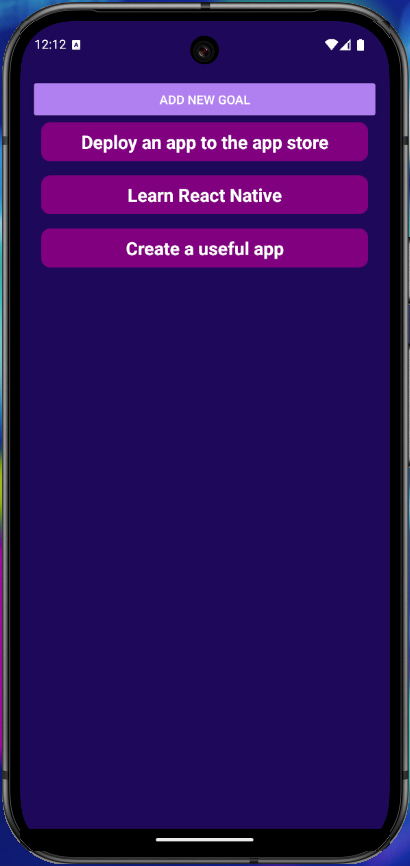
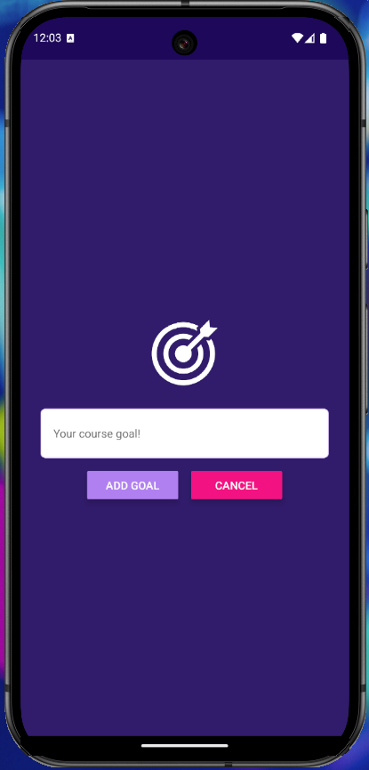

# Goals List

##### Table of Contents

 [Description](#description)    
 [Installation](#installation)  
 [Usage](#usage)   
 [Questions](#questions)  


## Description
A simple goal checklist application created using React Native. Users are able to create a list of goals, and delete each goal as they are completed.


## Installation
### Clone the repository:
```
git clone https://github.com/dgomie/RNCourse.git
```

### Install the required dependencies:
```
npm install
```

### Install Expo Go 
- Navigate to https://expo.dev/go and install the Expo Go app or emulator/simulator to your preferred device.

## Usage
- Press the "Add New Goal" button to launch the input modal. Tapping a goal will remove it from the list



- Within the goal modal, type your goal you wish to accomplish. Once done, press add goal. You will then be taken back to the main page with an updated goal list.




## Questions

For any questions regarding the repository, contact me via:

- Github: [dgomie](https://www.github.com/dgomie)
- Email: <a href="mailto:danny.f.gomez@gmail.com">danny.f.gomez@gmail.com</a>
